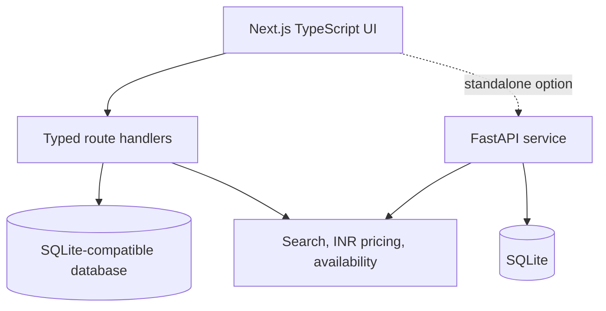

<!-- # Airbnb India Clone — Full-stack SDE assignment -->

An original Airbnb-style marketplace built with a Next.js App Router frontend, typed route handlers, and a SQLite-backed demo database. The codebase is organized so the production web app can live in GitHub and deploy cleanly to Vercel.

This submission is configured exclusively for India:

- Every seeded property is located in India.
- Hosts can enter an Indian city, while the country is locked to `India`.
- All prices, fees, totals, filters, and host revenue are displayed and stored in Indian rupees (`INR`, `₹`).
- Payment is mocked and no real card information is processed.

## Core features

### Guest experience

- Airbnb-style explore grid with original property photography
- Location search across Indian destinations
- Category, property-type, price, and pagination controls
- Listing gallery, amenities, host profile, reviews, and static map
- Date-range selection with server-side overlap validation
- INR price breakdown: nightly total, cleaning fee, service fee, and total
- Mock checkout with booking confirmation
- Persistent **Trips** and **Wishlists** views
- Responsive desktop, tablet, and mobile layouts

### Host experience

- Host dashboard with listings, reservations, ratings, and INR booking value
- Full listing CRUD with ownership checks
- India-only location entry
- Multi-photo URL entry, amenities, capacity, property type, and INR pricing
- Reservation overview for host-owned properties

## Tech stack

| Layer | Technology |
|---|---|
| Frontend | Next.js App Router, React, TypeScript, responsive CSS |
| Data layer | SQLite-compatible D1 adapter for the Next.js app |
| Optional backend | Python, FastAPI, SQLAlchemy, Pydantic |
| Validation | TypeScript, ESLint, production build, browser workflow tests |

## Repository structure

```text
.
├── app/                    # Next.js pages and API route handlers
│   ├── api/                # listings, bookings, favorites
│   ├── checkout/[id]/      # mocked checkout and confirmation
│   ├── host/               # dashboard and listing CRUD
│   ├── listing/[id]/       # property detail
│   ├── trips/              # guest bookings
│   └── wishlist/           # saved stays
├── components/             # reusable UI and workflows
├── lib/                    # types, India seed data, serializers
├── backend/
│   ├── app/                # FastAPI, SQLAlchemy models, schemas, seed logic
│   └── requirements.txt
├── db/                     # relational schema and initialization
├── docs/                   # frontend notes and deployment guidance
├── drizzle/                # SQLite-compatible migration
├── public/                 # optimized original property images and icons
└── vercel.json             # Vercel deployment config
```

## Architecture



## Vercel deployment

This repository includes a Vercel config that points production builds at `npm run vercel-build`.

1. Push the repo to GitHub.
1. Import it into Vercel as a Next.js project.
1. Let Vercel use the included `vercel.json`.
1. Set `BACKEND_API_BASE_URL` in Vercel to your Render backend URL.
1. If you want persistent guest data in production, connect a hosted database instead of the local SQLite fallback.

More detail lives in [docs/deployment.md](./docs/deployment.md).

The browser previews pricing and availability for usability. The server performs the final overlap check before inserting a booking:

```text
existing.check_in < requested.check_out
AND existing.check_out > requested.check_in
AND existing.status = "confirmed"
```

## Database schema

| Table | Purpose | Key relationships |
|---|---|---|
| `users` | Mock guest and host identities | One host → many listings; one guest → many bookings |
| `listings` | Indian property content, INR pricing, capacity, amenities, photos | Belongs to one host |
| `bookings` | Dates, guests, INR price snapshot, status, confirmation | Belongs to one listing and one guest |
| `reviews` | Rating and guest comment | Belongs to one listing and one user |
| `favorites` | Wishlist join table | Unique user-listing pair |

## Run the frontend locally

Requirements: Node.js 22.13+ and npm.

```bash
npm ci
npm run dev
```

Useful checks:

```bash
npm run lint
npx tsc --noEmit
npm test
```

## Run FastAPI with SQLite

```bash
cd backend
python -m venv .venv
source .venv/bin/activate          # Windows: .venv\Scripts\activate
pip install -r requirements.txt
uvicorn app.main:app --reload --port 8000
```

Open:

- API docs: `http://localhost:8000/docs`
- Health check: `http://localhost:8000/health`

`backend/airbnb.db` is created and seeded on first start.

## API overview

FastAPI uses the `/api/v1` prefix. The Next.js adapter provides equivalent paths under `/api`.

| Method | Endpoint | Description |
|---|---|---|
| `GET` | `/api/v1/listings` | Search, filter, and paginate Indian listings |
| `GET` | `/api/v1/listings/{id}` | Fetch one listing |
| `POST` | `/api/v1/listings` | Create an India-based host listing |
| `PATCH` | `/api/v1/listings/{id}` | Edit an owned listing |
| `DELETE` | `/api/v1/listings/{id}` | Delete an owned listing |
| `GET` | `/api/v1/bookings` | List guest trips or host reservations |
| `POST` | `/api/v1/bookings` | Validate dates and create an INR booking |
| `GET` | `/api/v1/favorites` | List a guest's wishlist |
| `POST` | `/api/v1/favorites` | Save a listing |
| `DELETE` | `/api/v1/favorites/{listing_id}` | Remove a saved listing |

Example booking request:

```json
{
  "listing_id": 1,
  "guest_id": 1,
  "check_in": "2026-09-10",
  "check_out": "2026-09-12",
  "guests": 2
}
```

## Assumptions

- Authentication uses fixed guest and host demo identities.
- All locations are restricted to India.
- All monetary values are INR; no currency conversion is performed.
- Card fields are demonstrative and are never stored or transmitted to a payment processor.
- Messaging, identity verification, and live price-pin maps are placeholders.
- Photo entry uses URLs or bundled local paths.
- Check-in is inclusive and check-out is exclusive.

## Original work notice

This is an educational Airbnb clone produced for technical evaluation. It is not affiliated with or endorsed by Airbnb, Inc. No Airbnb source code, proprietary data, or listing media was copied.
